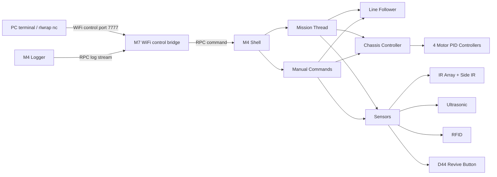
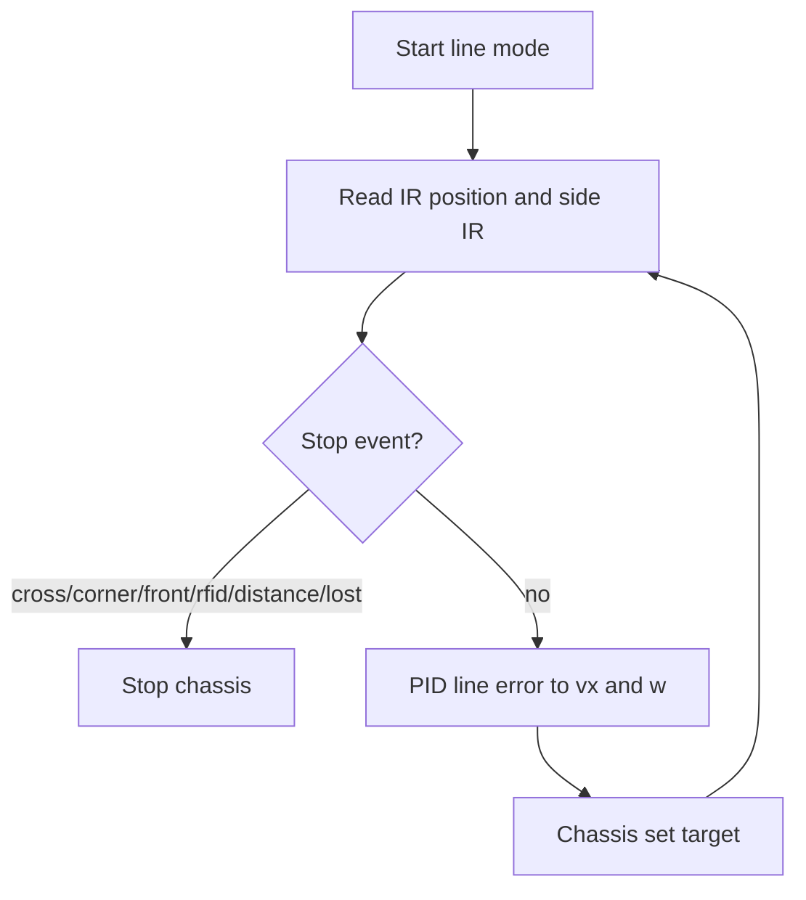

# Space Robot Rev 2026

Arduino GIGA R1 based robot software for the Term 3 Robotics Challenge. The current finals/viva code is in the `src/core_m4` and `src/core_m7` PlatformIO environments.

## Repository Structure

| Path           | Purpose                                                                                                                    |
| -------------- | -------------------------------------------------------------------------------------------------------------------------- |
| `src/core_m4/` | Main robot control: shell, logger, motors, chassis, sensors, IMU, RFID, line following, wall following, and mission flows. |
| `src/core_m7/` | WiFi control bridge. It forwards shell commands to M4 via RPC and streams logs back to the PC.                             |
| `include/`     | Shared headers and all main calibration constants in `config.hpp`.                                                         |
| `libraries/`   | Local libraries, including the QTR sensor library used by the IR line array.                                               |
| `docs/`        | Datasheets, checklist PDFs, API notes, diagrams, and testing evidence.                                                     |

## Hardware Summary

- Board: Arduino GIGA R1, using both cores.
- M4 core: real-time robot control.
- M7 core: WiFi control and RPC bridge.
- Actuators: four DC motors with encoders and L298N-style motor drivers.
- Sensors:
  - 9-channel IR line array for line following.
  - Left/right side IR sensors for cross and corner detection.
  - Front/left/right ultrasonic sensors.
  - MFRC522 I2C RFID reader.
  - ICM-20948 IMU for yaw-assisted turns.
  - Revive contact button on `D44`, active low.

## Software Overview



Main thread startup is in `src/core_m4/main.cpp`: it starts logger, shell, chassis, sensors, IMU and mission threads. The M4 `loop()` stays idle after setup.

## Build and Upload

Install PlatformIO, then build:

```bash
pio run -e giga_r1_m4
pio run -e giga_r1_m7
```

Upload M4:

```bash
pio run -e giga_r1_m4 -t upload
```

Upload M7:

```bash
pio run -e giga_r1_m7 -t upload
```

WiFi SSID/password and port are configured in `include/config.hpp`. The control port is currently `7777`.

## Running the Robot

Serial shell is available on `Serial1` at `115200`.

Wireless shell:

```bash
rlwrap nc <robot-ip> 7777
```

`rlwrap` gives command history and arrow-key editing. The M7 will print the robot IP after WiFi connects.

Common commands:

```text
start                  enter idle/runnable state
stop                   immediate software stop
state                  print current state
sensor                 print all sensors
sensor watch on        periodically print all sensors
sensor rfid            print RFID status
imu                    print IMU status
motor enc              print motor encoder/speed/PID state
move status            print chassis status
line cross 150         follow line until cross
line corner left 150   follow line until left corner
line rfid 150 any      follow line until any RFID
drive forward 150 10   drive forward 10 cm
turn 90                IMU turn right
turn ir left 300       rotate left until IR sees line
task 2                 run mission task 2
task status            print mission/task status
task stop              stop mission
```

## Key Behaviours

### Line Following

The line follower uses the 9-channel IR array position, with side IR sensors for cross/corner detection. It supports stopping on:

- cross
- left/right/any corner
- front ultrasonic threshold
- distance travelled
- RFID
- line lost

Implemented in `src/core_m4/line_follower.cpp`.



### Turning

Manual `turn` uses IMU yaw feedback. Mission turns use a hybrid strategy:

1. Turn part of the angle using IMU yaw.
2. Finish by rotating until the IR array sees the next line.

This reduces overshoot and helps re-align to the physical track.

### Mission Thread

Mission flows run in a permanent M4 mission thread. Shell command `task <id>` queues a mission request; the mission thread then runs a blocking task function. `stop` and `task stop` have priority and force line follower, wall follower and chassis outputs to stop.

Implemented in `src/core_m4/mission.cpp`.

## Implemented Tasks

| Task   | Status         | Implementation                                                                           |
| ------ | -------------- | ---------------------------------------------------------------------------------------- |
| Task 1 | Tested working | Basic line following.                                                                    |
| Task 2 | Tested working | Exit/intersection flow: cross, corners, RFID wait, wall/front stop.                      |
| Task 3 | Tested working | Solid-grid cross navigation.                                                             |
| Task 4 | Basic support  | Open-field drive mission using encoder distance.                                         |
| Task 5 | Basic support  | Ramp drive mission using encoder distance and front stop.                                |
| Task 6 | Partial        | Wall-follow mission exists but is limited by ultrasonic reliability and wheel mechanics. |
| Task 7 | Tested working | Obstacle detection at cross, obstacle bypass, return to line.                            |
| Task 8 | Tested working | Revive approach: line follow, speed zones by front distance, stop on D44 contact button. |

All `task <1..8>` commands are routed through the M4 mission thread. Task 1/4/5/6 are simpler mission flows; Task 2/3/7/8 are the main tested mission flows.

## Calibration Notes

Important calibration constants are in `include/config.hpp`:

- motor PID and feed-forward: `MOTOR_PID_KP`, `MOTOR_PID_KI`, `MOTOR_SPEED_KF`
- start/run PWM compensation: `MOTOR_PWM_START`, `MOTOR_PWM_RUN`
- encoder distance conversion: `CHASSIS_ENCODER_COUNTS_PER_CM`
- line PID: `LINE_KP`, `LINE_KD`
- ultrasonic filtering: `ULTRASONIC_SAMPLE_INTERVAL_MS`, `ULTRASONIC_LOW_PASS_ALPHA`
- turn control: `TURN_KP`, `TURN_KD`, `MISSION_TURN_IMU_RATIO`
- task distances/speeds: `TASK*_...`

Useful calibration commands:

```text
motor pid P I D
motor pidtest 100
motor pidtest 500
imu cal gyro
imu cal mag
sensor watch on
line status
```

## Testing Evidence

Testing notes and screenshot index are in `docs/testing.md`.

## Known Limitations

- Some ultrasonic modules were unreliable during testing. The front ultrasonic sensor was good enough for obstacle/front-stop behaviours, while left/right wall following was less reliable.
- The mecanum rollers had mechanical issues, so motion is treated like a normal four-wheel chassis rather than relying on sideways movement.
- Task 4-6 are less polished than Task 1/2/3/7/8.
- WiFi control uses RPC strings on M7; long-term soak testing should watch for memory issues, although current M4 control build is stable and compiles successfully.
