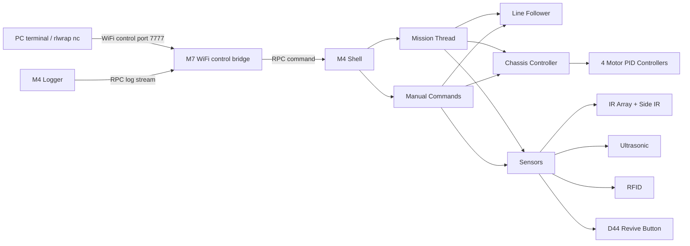
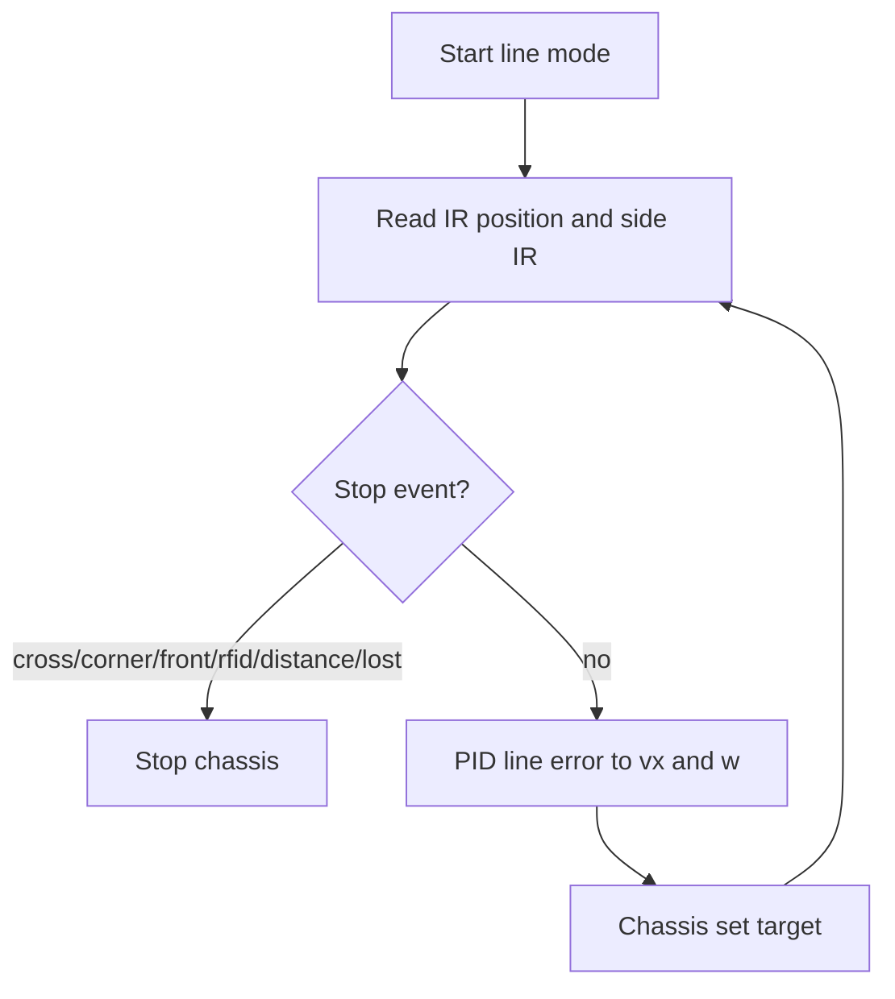

# Space Robot Rev 2026

Arduino GIGA R1 based robot software for the Term 3 Robotics Challenge. The current finals/viva code is in the `src/core_m4` and `src/core_m7` PlatformIO environments.

## Repository Structure

| Path           | Purpose                                                                                                                    |
| -------------- | -------------------------------------------------------------------------------------------------------------------------- |
| `src/core_m4/` | Main robot control: shell, logger, motors, chassis, sensors, IMU, RFID, line following, wall following, mission flows, and navigation adapters. |
| `src/core_m7/` | WiFi control bridge. It forwards shell commands to M4 via RPC and streams logs back to the PC.                             |
| `include/`     | Shared headers and all main calibration constants in `config.hpp`.                                                         |
| `libraries/`   | Local libraries, including the QTR sensor library used by the IR line array.                                               |
| `docs/`        | Datasheets, checklist PDFs, API notes, diagrams, and testing evidence.                                                     |

## Hardware Summary

- Board: Arduino GIGA R1, using both cores.
- M4 core: real-time robot control.
- M7 core: WiFi control and RPC bridge.
- Actuators: four DC motors with encoders and L298N-style motor drivers.
- Sensors:
  - 9-channel IR line array for line following.
  - Left/right side IR sensors for cross and corner detection.
  - Front/left/right ultrasonic sensors.
  - MFRC522 I2C RFID reader.
  - ICM-20948 IMU for yaw-assisted turns.
  - Revive contact button on `D44`, active low.
  - Hardware kill switch on `D10`, active low.
  - State LEDs: red on `D17`, green on `D16`.

## Software Overview



Main thread startup is in `src/core_m4/main.cpp`: it starts logger, shell, chassis, sensors, IMU and mission threads. The M4 `loop()` stays idle after setup.

### Key Source Files

| File | Responsibility |
| ---- | -------------- |
| `src/core_m4/main.cpp` | M4 startup and RTOS thread creation. |
| `src/core_m4/mission.cpp` | High-level blocking mission flows for `task 1` to `task 8`. |
| `src/core_m4/motion_primitives.cpp` | Shared blocking movement helpers for distance driving, IMU turns and IR line reacquisition. |
| `src/core_m4/mission/` | Higher-level navigation/planning code and adapters to the robot movement API. |
| `src/core_m4/line_follower.cpp` | PID line tracking and line stop conditions: cross, corner, front stop, distance, RFID and lost-line detection. |
| `src/core_m4/chassis.cpp` | Chassis velocity target handling, encoder distance support and stop output. |
| `src/core_m4/motor.cpp` | Per-wheel encoder feedback, velocity PID, PWM compensation and motor commands. |
| `src/core_m4/sensors.cpp` | IR array, side IR, ultrasonic sensors, kill switch and revive/contact button. |
| `src/core_m4/imu.cpp` | IMU sampling, yaw estimation and gyro/magnetometer calibration. |
| `src/core_m4/rfid.cpp` | MFRC522 RFID reader polling and UID caching. |
| `src/core_m4/wall_follower.cpp` | Wall-following controller using side ultrasonic and IMU heading assist. |
| `src/core_m4/commands/` | Shell command handlers for manual testing and mission control. |
| `src/core_m7/main.cpp` | WiFi shell bridge and M4 RPC/log forwarding. |

## Build and Upload

Install PlatformIO, then build:

```bash
pio run -e giga_r1_m4
pio run -e giga_r1_m7
```

Upload M4:

```bash
pio run -e giga_r1_m4 -t upload
```

Upload M7:

```bash
pio run -e giga_r1_m7 -t upload
```

WiFi SSID/password and port are configured in `include/config.hpp`. The control port is currently `7777`.

## Running the Robot

Serial shell is available on `Serial1` at `115200`.

Wireless shell:

```bash
rlwrap nc <robot-ip> 7777
```

`rlwrap` gives command history and arrow-key editing. The M7 will print the robot IP after WiFi connects.

Common commands:

```text
start                  enter idle/runnable state
stop                   immediate software stop
state                  print current state
sensor                 print all sensors
sensor watch on        periodically print all sensors
sensor rfid            print RFID status
imu                    print IMU status
motor enc              print motor encoder/speed/PID state
motor pid P I D        tune wheel velocity PID
move status            print chassis status
line cross 150         follow line until cross
line corner left 150   follow line until left corner
line rfid 150 any      follow line until any RFID
line pid               print line follower PID
line pid 0.2 0.1       tune line follower PID remotely
wall status            print wall follower strategy and state
wall pid               print wall follower distance/yaw gains
wall pid 3 10 220      tune wall follower distance gain, yaw gain and max turn speed
drive forward 150 10   drive forward 10 cm
turn 90                turn right by 90 degrees
turn ir left 300       rotate left until IR sees line
task 2                 run mission task 2
task status            print mission/task status
task stop              stop mission
```

## Key Behaviours

### Line Following

The line follower uses the 9-channel IR array position, with side IR sensors for cross/corner detection. It supports stopping on:

- cross
- left/right/any corner
- front ultrasonic threshold
- distance travelled
- RFID
- line lost

Implemented in `src/core_m4/line_follower.cpp`.



### Turning

Turns use IMU yaw feedback and, where required by the mission flow, an IR line reacquisition step:

1. Turn part of the angle using IMU yaw.
2. Finish by rotating until the IR array sees the next line.

This reduces overshoot and helps re-align to the physical track.

### Mission Thread

Mission flows run in a permanent M4 mission thread. Shell command `task <id>` queues a mission request; the mission thread then runs a blocking task function. `stop` and `task stop` have priority and force line follower, wall follower and chassis outputs to stop.

Implemented in `src/core_m4/mission.cpp`.

### Wall Following

Wall following combines side ultrasonic distance with IMU yaw hold. At the start of a wall-follow segment, the current yaw is saved as the heading reference. During the run:

- `yaw_error = start_yaw - current_yaw`
- `wall_error = wall_distance - target_wall_distance`
- `w = yaw_term + distance_term`, clamped by `max_w`

The controller supports remote tuning:

```text
wall pid
wall pid <dist_kp> <yaw_kp> [max_w]
```

`wall status` prints the active side, target distance, travelled distance, wall error, yaw error, PID gains and final `w`.

### Safety And State LEDs

The robot has both software and hardware stop paths:

- `stop` or `task stop` from the shell stops mission, line follower, wall follower and chassis output.
- The hardware kill switch on `D10` is checked in the sensor thread. Each debounced press toggles between `STOPPED` and `IDLE`.
- In `STOPPED`, the red LED on `D17` blinks every 500 ms.
- When the revive/contact button is pressed, the green LED on `D16` turns on and the red LED turns off.

## Implemented Tasks

| Task   | Status                       | Implementation                                                                           |
| ------ | ---------------------------- | ---------------------------------------------------------------------------------------- |
| Task 1 | Tested working               | Basic line following.                                                                    |
| Task 2 | Tested working               | Exit/intersection flow: cross, corners, RFID wait, wall/front stop.                      |
| Task 3 | Tested working               | Solid-grid cross navigation.                                                             |
| Task 4 | Tested working               | Open-field mission using left wall follow for long straight segments, encoder distance for the middle segment, and IMU turns. |
| Task 5 | Implemented and tuned        | Two-stage ramp approach: drive until left wall is detected, then left wall follow for 180 cm. |
| Task 6 | Implemented and tuned        | Left wall-follow mission for 120 cm using ultrasonic distance and IMU heading hold.       |
| Task 7 | Tested working               | Obstacle detection at cross, obstacle bypass, return to line.                            |
| Task 8 | Tested working               | Revive approach: line follow, speed zones by front distance, stop on D44 contact button. |

All `task <1..8>` commands are routed through the M4 mission thread.

## Calibration Notes

Important calibration constants are in `include/config.hpp`:

- motor PID and feed-forward: `MOTOR_PID_KP`, `MOTOR_PID_KI`, `MOTOR_SPEED_KF`
- PWM safety limit and compensation: `MOTOR_PWM_MAX`, `MOTOR_PWM_START`, `MOTOR_PWM_RUN`
- encoder distance conversion: `CHASSIS_ENCODER_COUNTS_PER_CM`
- line PID: `LINE_KP`, `LINE_KD`
- wall-follow gains: `WALL_DIST_KP`, `WALL_YAW_KP`, `WALL_MAX_WHEEL_SPEED`
- ultrasonic filtering: `ULTRASONIC_SAMPLE_INTERVAL_MS`, `ULTRASONIC_LOW_PASS_ALPHA`
- turn control: `TURN_KP`, `TURN_KD`, `MISSION_TURN_IMU_RATIO`
- task distances/speeds: `TASK*_...`

The final motor PWM output is hard-limited by `MOTOR_PWM_MAX`, currently `150`, to protect the motors with the updated battery setup.

Useful calibration commands:

```text
motor pid P I D
motor pidtest 100
motor pidtest 500
imu cal gyro
imu cal mag
sensor watch on
line status
line pid
line pid 0.2 0.1
wall status
wall pid
wall pid 3 10 220
```

## Testing Evidence

Testing notes and screenshot index are in `docs/testing.md`.

## Known Limitations

- The mecanum rollers had mechanical issues, so motion is treated like a normal four-wheel chassis rather than relying on sideways movement.
- Wall-follow performance depends on the quality and mounting angle of the side ultrasonic sensor. The left ultrasonic module was replaced and is used for the tuned wall-follow tasks.
- WiFi control uses RPC strings on M7 instead of a full MQTT workflow. M7 is kept as a wireless shell/log bridge while real-time control remains on M4.
